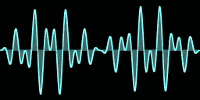

Creates a graph of an audio waveform, where the height of the curve is determined by the amplitude of each audio sample.

   - `Fill Color` — The color of the area between the curve and the axis.
   - `Line Color` — The color of the curve.
   - `Height` — The output image's height, in pixels.
   - `Sync Amplitude` — Stabilizes the graph, so that the waveform appears to stay in the same place instead of jumping side-to-side with each new audio sample buffer.
      - This node horizontally shifts the waveform so that the first point where the sample amplitude rises above the Sync Amplitude is positioned at `Sync Center` (similar to an oscilloscope's trigger function), in Vuo Coordinates.
      - If no value within the sample buffer exceeds the Sync Amplitude, this node doesn't stabilize the graph. The first sample is plotted on the left side of the image, and the last sample is plotted on the right side of the image.
   - `Attenuate Ends` — When true, the amplitude tapers toward zero on the left and right ends of the graph.  When false, each sample is plotted at its actual amplitude.

The output image's width is 512 pixels (the size of a sample buffer).

