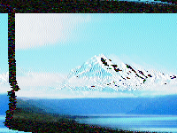

Distorts the image so it appears to have been transmitted as an analog television signal.

   - `Flagging` — Skews the top of the image toward the right, and the bottom of the image toward the left, as though the video signal has [time base errors](https://bavc.github.io/avaa/artifacts/time_base_error.html).
   - `Tearing` — Skews each row of the image toward the right, based on the brightness: another form of time base error.
   - `Edge Blanking` — The width, in Vuo Coordinates, of the black bars to draw along the left and right sides of the image, simulating the [horizontal blanking interval](https://en.wikipedia.org/wiki/Horizontal_blanking_interval).
   - `Bearding` — The brightness threshold at which light parts of the image turn dark, simulating the way analog video recorders react to [video signal overload](https://bavc.github.io/avaa/artifacts/bearding.html).
   - `Bearding Distance` — How far left or right to move the bearded areas, simulating the horizontal scan delay between overload and reaction to overload.
   - `Ghosting` — The strength of horizontal echoes, simulating [long analog wave reflections](https://bavc.github.io/avaa/artifacts/ghost.html).
   - `Ghosting Distance` — How far left or right to move each echo.
   - `Ringing` — The strength of horizontal oscillations, simulating [short analog wave reflections](https://bavc.github.io/avaa/artifacts/ringing.html).  The distance is always 1 pixel, and every other ring is inverted.
   - `Noise Amount` — How much [random chrominance noise](https://bavc.github.io/avaa/artifacts/chrominance_noise.html) to add to the image.  More noise is added in dark areas of the image.
   - `Vertical Offset` — How far the image is vertically shifted, simulating [loss of vertical sync](https://bavc.github.io/avaa/artifacts/sync_loss.html).

This node also applies some random variation to the above parameters, to produce an animated effect.

Thanks to the Bay Area Video Coalition for their [AV Artifact Atlas](https://bavc.github.io/avaa/), whose example images and descriptions inspired this node.
