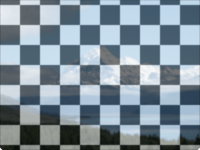

Blends two images into a single image.

   - `Background` — The background image (bottom layer) to blend.
   - `Foreground` — The foreground image (top layer) to blend.
   - `Blend Mode` — The way that the images should be blended. For information about blend modes, see: 
      - [Wikipedia article on blend modes](http://en.wikipedia.org/wiki/Blend_modes)
      - [Photoshop blend modes](http://help.adobe.com/en_US/photoshop/cs/using/WSfd1234e1c4b69f30ea53e41001031ab64-77eba.html)
      - [GIMP blend modes](http://docs.gimp.org/en/gimp-concepts-layer-modes.html)
   - `Foreground Opacity` — The opacity that the foreground image component should have in the blended image, ranging from 0 to 1.

The resulting image uses the dimensions of the background image (unless the background image is empty, in which case it uses the dimensions of the foreground image). The foreground image is stretched to match the size of the background image.

Thanks to [Romain Dura](http://mouaif.wordpress.com/2009/01/05/photoshop-math-with-glsl-shaders/) for the GLSL implementations of many blend modes.

