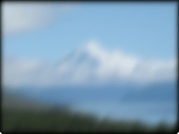

Distorts the image with a blur effect.

This node applies a gaussian blur to the passed image.  The radius determines how blurry the output image will appear.

   - `Radius` — The pixel radius to affect when applying the blur.  Larger values mean more blurry, while a value of '0' will result in a non-blurred output image.
   - `Expand Bounds` - If false, the image size will remain the same.  If true, the image will expand to encapsulate the blurred pixels around the border.

