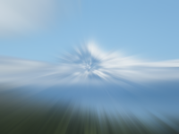

Distorts the image with a blur effect radiating out from, or around, a point.

This node simulates the effect of adjusting the camera lens's zoom or roll (rotation) while the shutter is open.  The radius determines how blurry the output image will appear.

   - `Image` — The image to blur.
   - `Mask` — Controls how much each part of the image is blurred.  If no mask is provided, the image is uniformly blurred by the amount specified in `Radius`.  Bright/opaque areas in the mask cause the corresponding part of `Image` to be heavily blurred (up to `Radius`); dark/transparent areas in the mask cause no blur.  The mask is stretched to match the width and height of the other image.
   - `Shape` — The relative weights of the pixels factored into the blur.
      - The **Gaussian** distribution ("bell curve") is smoothest, but its long asymptotic tail makes it expensive to compute.
      - The **linear** distribution is almost as smooth, and is faster to compute.
      - The **box** distribution (constant) weights all pixels equally, resulting in relatively sharp edges, and is thus good for simulating motion blur.
   - `Center` — The position from which the effect originates.  At (0,0), the effect originates from the center; at (-1,0), the effect originates from the left edge.
   - `Radius` — The maximum radius, in points, to affect when applying the blur.  Larger values mean more blurry, while a value of '0' will result in a non-blurred output image.
   - `Dispersion` — The pattern the blur follows — linear (zoom) or radial (roll).
   - `Direction` — Whether the blur causes the image to streak inward (clockwise if radial), outward (counterclockwise), or symmetrically in both directions.
   - `Expand Bounds` — If false, the image size will remain the same.  If true, the image will expand to encapsulate the blurred pixels around the border.
   - `Quality` — The ratio of pixels to factor into the blur calculation.  When 1, all necessary pixels are examined, resulting in an accurate blur.  When less than 1, fewer pixels are examined, resulting in a faster-but-less-accurate blur.

