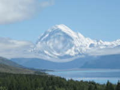

Distorts the image by making part of it appear to move outward or inward.

   - `Center` — The central point of the bulge, in Vuo Coordinates.
   - `Scale` — The amount to pull (if greater than 0) or push (if less than 0) the image. At 0, there is no bulge.
   - `Radius` — The radius or size of the bulge, in Vuo Coordinates. At 0, there is no bulge.

