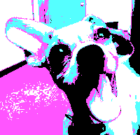

Changes the image's colors to the closest colors in the 1981 IBM PC's 4-color CGA (Color Graphics Adapter) palette.

   - `Background Color` — The first of the 4 colors.  This can be one of 16 pre-defined colors.
   - `Palette` — The remaining 3 colors.  6 sets are available.

Thanks to [Brad Larson](https://github.com/BradLarson/GPUImage) and [Martinus Magneson](https://vuo.org/user/3272) for the GLSL implementation this node is based on.
