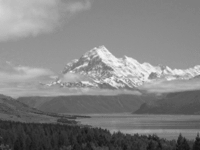

Converts an image to grayscale.

   - `Type` — How to convert colors to grayscale:
      - `Perceptual` — Use the overall perceptual brightness of each pixel's color, using a particular ITU specification.
	  - `Desaturate` — Convert the image to HSL colorspace, and set the saturation to 0, or, equivalently, use the HSL luminance channel.
     - `Average Components (RGB)` — For each pixel's color, use the average of its red, green, and blue intensities.
     - `Lightest` and `Darkest Components (RGB)` — For each pixel's color, use the maximum or minimum of its red, green, and blue intensities.
      - `Red`, `Green`, `Blue` — Use just one component of the color.
   - `Amount` — How strongly to apply the grayscale conversion.  At 0, the input image is unchanged.  At 1, the image is fully grayscale.

