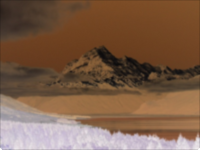

Alters an image's colors by replacing each color with its opposite. 

Inverse (opposite) colors are based on an RGB (red-green-blue) color system. For example: 

   - The inverse of black (0, 0, 0) is white (1, 1, 1). 
   - The inverse of bright blue (0, 0, 1) is bright yellow (1, 1, 0). 
   - The inverse of dull green (0, 0.5, 0) is bright pink (1, 0.5, 1). 

