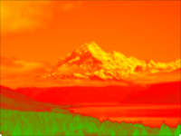

Alters an image's colors by mapping the image's brightness to a color gradient. 

This node finds the perceptual brightness of each point in the image — that is, where the point falls in the range of black to white. It then finds the corresponding point in the gradient defined by the given colors — that is, where the point falls in the range of first color to last color — and creates a new image with those colors. Finally, it blends the original image with the new image. 

   - `Colors` - The colors to transition between in the gradient. The first color corresponds to black, and the last color corresponds to white. 
   - `Filter Opacity` - The opacity that the new image should have when blended on top of the original image, ranging from 0 (fully transparent) to 1 (fully opaque). 

