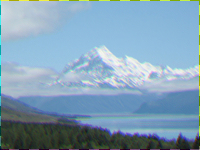

Distorts the image with a color-shifting effect.

Each color in a computer image is represented as a combination of [red, green, and blue components](http://en.wikipedia.org/wiki/RGB_color_model). For example, a pale pink color is made up of equal measures of red and blue, plus a little green. You can think of the image as three separate images (**channels**) — one red, one blue, and one green — superimposed.

This node splits the image into its red, green, and blue channels, independently moves the position of each channel, then recombines them into a single image.

   - `Red Offset`, `Green Offset`, `Blue Offset` — The distance to offset each channel, in Vuo Coordinates.

