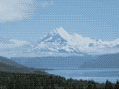

Alters an image's colors to use only colors from a given palette.

   - `Palette` — A list of colors to allow in the output image.  You can either provide a fixed list of colors, or dynamically generate it using `Make Palette from Image`.  For colors where there's no exact match in the palette, this node tries to find the most similar color (the color with the lowest RGB geometric distance).
   - `Dithering` — When reducing a many-colored image to fewer colors, you may see "banding" artifacts where formerly-gradual color changes become solid regions.  This port controls how to compensate for that:
      - **White Noise** — randomly brightens or darkens colors in the input image, producing a rough scattering effect.
      - **Gradient Noise** — uses a periodic pattern to brighten or darken colors, producing a smoother scattering effect.  The number (0.05, 0.02, 0.01) represents the width of one noise period, in Vuo Coordinates.
      - **Bayer** — uses a pattern to brighten or darken colors, producing a thatched or crosshatched effect.  The number represents the pattern's tile size (e.g. for `2x2`, the pattern repeats every 2 pixels on the X and Y axes).  These patterns are designed to produce uniform textures, minimizing periodic artifacts, as described in Bryce Bayer's 1973 paper, "An Optimum Method for Two-Level Rendition of Continuous-Tone Pictures".
   - `Dithering Intensity` — How much of the above dithering to apply to the image.

Thanks to [Gisle Martens Meyer](https://uncannyplanet.com) for funding development of this node!
