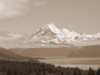

Converts an image to sepia tone, making it look like an old-fashioned photograph.

   - `Amount` — How strongly to apply the sepia tone.  At 0, the input image is unchanged.  At 1, the image is fully sepia toned.

