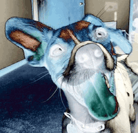

Inverts the colors of some parts of the image depending on the brightness.

   - `Threshold` — The cutoff point at which to start inverting colors.  When `Invert Lighter Colors` is true, `Threshold` 0 results in all colors being inverted, since all brightnesses are greater than or equal to 0.  When `Invert Lighter Colors` is false, `Threshold` 1 results in all colors being inverted, since all brightnesses are less than or equal to 1.
   - `Sharpness` — How sharp the transitions from non-inverted to inverted will be.  When 0, the transitions are gradual; when 1, the transitions are sharp.
   - `Invert Lighter Colors` — When true, the colors lighter than `Threshold` are inverted — this results in a darker image, matching Photoshop's behavior.  When false, the colors darker than `Threshold` are inverted — this results in a lighter image.

Thanks to [Brad Larson](https://github.com/BradLarson/GPUImage) and [Martinus Magneson](https://community.vuo.org/u/MartinusMagneson) for the GLSL implementation this node is based on.
