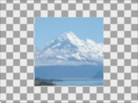

Outputs only a rectangular part of an image. 

The rectangular part is defined by the `Center` point, `Width`, and `Height`, all in Vuo Coordinates. 

The rectangle is limited to the input image's boundaries. If the rectangle is larger than the input image, then the output image will be the same as the input image. 

As an example, with `Center` = (0, 0), `Width` = 1, `Height` = 1, the cropped image would be the middle of the original image. 

