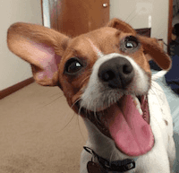
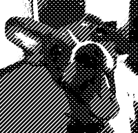

Creates a crosshatch pattern from an image.

   - `Background Color` and `Line Color` — The base colors used to create the crosshatch pattern.  When multiple lines overlap, the `Line Color`s are blended subtractively.
   - `Threshold` — The base cutoff point between dark (0) and light (1).  The lines are divided into 4 groups (downward slope even and odd, and upward slope even and odd), and this `Threshold` value is scaled for each group (1x, .5x, .75x, and .3x, respectively).  Colors that fall below each scaled threshold are drawn with `Background Color`; colors that fall above are drawn with `Line Color`.
   - `Width` — The width of each diamond of the crosshatch pattern, in Vuo Coordinates.
   - `Center` — The position of the center diamond.
   - `Coverage` — The portion of each diamond covered by `Line Color`, from 0 (hairline) to 1 (fully covered).

Thanks to [Brad Larson](https://github.com/BradLarson/GPUImage) and [Martinus Magneson](https://vuo.org/user/3272) for the GLSL implementation this node is based on.
