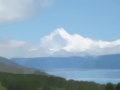

Distorts the image by expanding or shrinking bright areas.

This node applies a morphological dilation (or erosion) filter to the input image.  For each pixel in the output image, nearby pixels (determined by the `Shape` and `Radius`) are examined, and either the brightest (dilation) or darkest (erosion) component is chosen.

This filter is useful for filling in holes in grayscale image masks, adding an outline to text, or removing overblown highlights or noise from a photograph.

   - `Image` — The image to filter.
   - `Shape` — The pattern of nearby pixels to examine.
   - `Radius` — How far to search (in points), and whether to dilate (positive radius) or erode (negative radius).
   - `Rescind` — If true, the filter is applied twice, first with `Radius`, then with `-Radius`: morphological "opening" (erosion followed by dilation) or "closing" (dilation followed by erosion).  This preserves more of the structure of the image.

