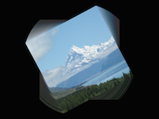

Displays an image with a feedback trail.

   - `Image` — The image to be blended with the feedback trail.
   - `Image Transform` — How to blend `Image` into the feedback trail.
   - `Feedback Transform` — How to alter the feedback trail during each frame.
   - `Feedback Opacity` — The intensity of the feedback trail (how much it feeds back each time), ranging from 0 to 1.
   - `Pixel Aligned` — Whether to snap the feedback image's transform to the nearest pixel. This is useful if you want to ensure that the feedback trail remains sharp — otherwise, every time the feedback is blended, it may land in between pixels, and the trail may blur. When enabled, translation is snapped to the nearest pixel, rotation is snapped to the nearest 90°, and scale is ignored (the feedback is always drawn at 1:1 scale).
   - `Image in Foreground` — If true, the input `Image` is rendered in front of its feedback trail. If false, it is rendered behind its feedback trail. 
   - `Width`, `Height` — The width and height of the output image, in pixels.
   - `Color Depth` — The number of bits to use to represent each color channel in the output image; higher values are more precise but use more graphics storage space. Images are typically 8 bits per channel (“8bpc”), though with image feedback, you may want to use higher precision.

