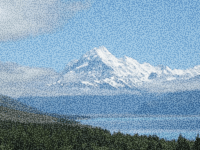

Lightens and darkens random parts of the image to make it look like it was shot on photographic film stock.

   - `Time` — Changes the random pattern of the grains.  To animate the grains, connect a continuously increasing number, such as the output of the [Fire on Display Refresh](vuo-node://vuo.event.fireOnDisplayRefresh) node's `Refreshed at Time` port.
   - `Density` — How close together the grains are, ranging from 0 (no grains) to 1 (fully-packed grains).
   - `Scale` — How large each grain is, in Vuo Coordinates.
   - `Amount` — The range of brightness variation in the grains.

