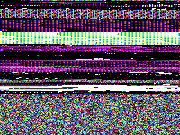

Converts raw data bytes to an image, creating glitchy-looking textures.

The data fills the image starting in the top-left, then proceeds row-wise.  For example, if the data consists of 3 bytes with values 0, 255, and 0, with Format Grayscale and Depth 8bpc, this node outputs black, white, and black pixels in a repeating pattern.

   - `Data` — The data bytes to reinterpret.
   - `Width` and `Height` — The size of the image to create.
   - `Format` — Whether to convert each data value to a single grayscale luminance value, or to a single component of an RGB color.
   - `Depth` — How many bytes of data to convert to a single grayscale value or RGB component:
      - 8bpc = 1 byte — each byte is interpreted as a normalized value (0..255 -> 0..1)
      - 16bpc = 2 bytes — each pair of bytes is interpreted as a [half-float](https://en.wikipedia.org/wiki/Half-precision_floating-point_format#IEEE_754_half-precision_binary_floating-point_format:_binary16)
      - 32bpc = 4 bytes — each quartet of bytes is interpreted as a [32-bit floating-point value](https://en.wikipedia.org/wiki/Floating-point_arithmetic#Internal_representation)
   - `Repeat` — When true, if the data runs out before the image is filled, this node copies the data over and over until the image is filled.  When false, if the data runs out, the remainder of the image is filled with black.  (Either way, if more data is provided than is needed to fill the image, the beginning of the data is used and the extra data is ignored.)

