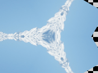

Applies a radial reflection effect to an image.

   - `Sides` — The number of times the input image is reflected.  A fractional number of sides means there will be mostly complete reflections with one final incomplete reflection.
   - `Angle` — The counterclockwise rotation of the reflection origin, in degrees.  When `Angle` is 0, the reflection origin points rightward.
   - `Blade Center` — The position in the output image at which all the reflections intersect, in Vuo Coordinates.
   - `Image Center` — The position in the input image at which all the reflections intersect, in Vuo Coordinates.
   - `Reflect Odd Sides` — When true, odd-numbered sides (counting counterclockwise from the reflection origin) are flipped, to produce a continuous image.  When false, each copy of the image is rotated but not reflected.

By default Vuo's images are transparent outside their defined bounds.  Before feeding an image to this node, you can use the `Change Wrap Mode` node's "Mirrored Repeat" mode to produce a solid image no matter which center points you choose.

