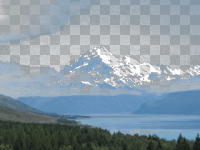

Changes the darker and/or lighter colors in the image to transparent.

Any colors in the image that fall outside the given `Preserved Brightnesses` are changed to transparent (masked).

   - `Preserved Brightnesses` — The range of brightnesses to preserve. Any colors that fall outside this range are changed to transparent.
   - `Sharpness` — How sharp the edges of masked areas will be. A value of 0 means the transition to transparent is very gradual; a value of 1 means the transition is immediate.
   - `Brightness Type` — The measure of darkness or lightness to use.  See `Make Grayscale Image` for further information.
   - `Show Image` — Whether to show the colors from the input image.  If false, colors within the specified range are output as solid white.

