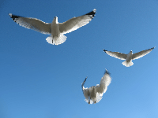
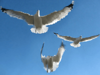

Removes uninteresting content from the image.

This node uses liquid resizing to reduce the size of the image (which removes uninteresting content), then uses liquid resizing again to expand the image back to its original size.

   - `Amount` — How much to downscale the image.  At 0, the image is unchanged.  At 0.5, the image is liquid resized to half its original size in each dimension, discarding ¾ of its content.
   - `Rigidity` — How strongly to preserve vertical and horizontal lines all the way through the image.  At 0, this node may remove or insert craggy, winding paths through the image.  At 1, this node may only remove or insert vertical and horizontal lines.
   - `Preserve Mask`, `Discard Mask` — Optional images specifying which parts of the source image to try to preserve or discard.  For `Preserve Mask`, areas that are bright and opaque are preserved.  For `Discard Mask`, areas that are bright and opaque are discarded.  In both masks, areas that are dark or transparent are unaffected.  These masks should be the same size as the source image.

This is an expensive, CPU-based operation, so it will only work in realtime for small images (a few hundred pixels wide and high).  Higher `Rigidity` values are faster.

