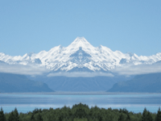

Reflects one half or one quarter of an image.

   - `Horizontal Reflection` — How the image should be reflected across its vertical center line.
      - *None* — No horizontal reflection.
      - *Reflect Left Half* — The left half of the image is shown twice.
      - *Reflect Right Half* — The right half of the image is shown twice.
   - `Vertical Reflection` — How the image should be reflected across its horizontal center line.
      - *None* — No vertical reflection.
      - *Reflect Top Half* — The top half of the image is shown twice.
      - *Reflect Bottom Half* — The bottom half of the image is shown twice.

