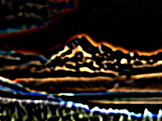

Shows only an image's edges.

   - `Channels` — Which combination of image channels to find the edges of.
   - `Radius` — The distance, in points, to blur the image before finding its edges.  Larger values are helpful for reducing noise.
   - `Intensity` — How bright (or dark) the edges are.
   - `Threshold` — The cutoff point when deciding between edges and non-edges.  Larger values hide softer edges.
   - `Range` — How to convert the edges into a visible image.  The edge colors depend on whether an object is lighter or darker than its background:
      - `Unipolar` — Against a darker background, interior edges are dark, exterior edges are bright, and non-edges are grey, producing a nimbus effect.  Negating `Intensity` reverses the edges, and produces an effect like embossing or relief printing.
      - `Bipolar` — Against a darker background, exterior edges are bright, and interior edges and non-edges are dark.
      - `Absolute` — Both interior and exterior edges are bright, and non-edges are dark.

This node applies a mathematical transformation to the image to find its edges — it blurs the image and finds its 2D partial derivative (the "Laplacian of Gaussian").

