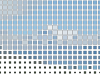

Distorts the image by displaying it at lower resolution, so that it has fewer and larger pixels.  Unlike the `Pixellate Image` node, this node provides more control over how the pixels appear.

   - `Pixel Size` — The width and height of each pixel, in Vuo Coordinates. At 0, the image is unchanged. At 2, each pixel is as wide as the image. 
   - `Center` — The position from which the pixels appear to grow.  At (0,0), the pixels appear to grow from the center; at (-1,0), the pixels appear to grow from the left edge.
   - `Sharpness` — How sharp the edges of the pixels are. When 0, the edges are blurry; when 1, the edges are sharp.
   - `Coverage` — Within each enlarged pixel, the size of the visible square.  When 0, the squares are invisible; when 1, the squares fill up the entire enlarged pixel area.  The size of the visible squares is also affected by the `Brightness Factor`.
   - `Brightness Factor` — How much the pixel's brightness affects the size of its visible square.
   - `Colors` — How many variations of each color channel are visible (similar to the `Posterize` node).  You can produce halftone-style effects by using a high `Brightness Factor` combined with a low number of colors.

