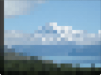

Distorts the image by displaying it at lower resolution, so that it has fewer and larger pixels. 

   - `Pixel Size` — The width and height of each pixel, in Vuo Coordinates. At 0, the image is unchanged. At 2, each pixel is as wide as the image. 
   - `Center` — The position from which the pixels appear to grow.  At (0,0), the pixels appear to grow from the center; at (-1,0), the pixels appear to grow from the left edge.

