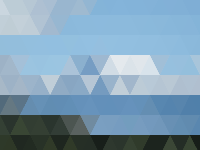
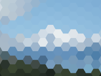

Distorts the image by displaying it using a grid of rectangles, triangles, or hexagons.

   - `Pixel Shape` — How enlarged pixels should be drawn and tiled.
   - `Pixel Width` — The width of each enlarged pixel, in Vuo Coordinates. At 0, the image is unchanged. At 2, each shape is as wide as the image.
   - `Center` — The position from which the shapes appear to grow as `Pixel Width` increases.  At (0,0), the shapes appear to grow from the center; at (-1,0), the shapes appear to grow from the left edge.

Thanks to [Ruslan Shestopalyuk](https://web.archive.org/web/20160519195648/http://www.gdreflections.com/2011/02/hexagonal-grid-math.html), [Agnius Vasiliauskas](https://web.archive.org/web/20160430035627/http://coding-experiments.blogspot.com/2010/06/pixelation.html), and [Strawbry_jam](https://web.archive.org/web/20170207200837/https://forum.yoyogames.com/index.php?threads/triangular-grid-snap.2882/#post-22111) for implementing parts of the GLSL code used in this node.
