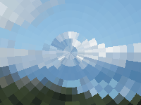

Distorts the image by splitting it into radial slices.

   - `Pixel Diameter` — The width of the center circle, in Vuo Coordinates.  At 0, the image is unchanged.  At 2, the center circle is as wide as the image.
   - `Pixel Angle` — The arc size of each pixel, in degrees.  At 0, the image is unchanged.  At 360, each pixel is a complete circle.
   - `Center` — The position from which the pixels appear to grow.  At (0,0), the pixels appear to grow from the center; at (-1,0), the pixels appear to grow from the left edge.

Thanks to [Brad Larson](https://github.com/BradLarson/GPUImage) and [Martinus Magneson](https://community.vuo.org/u/MartinusMagneson) for implementing parts of the GLSL code used in this node.
