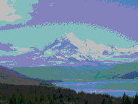

Reduces the number of colors in an image, creating a screen-printed poster effect.

   - `Image` — The source image to apply this filter to.
   - `Colors` — How many variations of each color channel to use when filtering a pixel.  For example, a value of 6 means that the Red, Blue, and Green channels that make up a color will each have 6 shades, making 216 total color possibilities (6 * 6 * 6).

