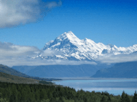

Alters an image's colors by reducing the amount of the haze color and increasing the contrast.

   - `Haze Color` — The color of the haze to reduce.  Use the magnifying glass or eyedropper tool within the color picker to select a hazy part of the image.
   - `Reduction at Top` and `Reduction at Bottom` — How strongly to remove the `Haze Color`.  The reduction amount smoothly fades across the image from top to bottom.

Thanks to [Brad Larson](https://github.com/BradLarson/GPUImage) and [Martinus Magneson](https://community.vuo.org/u/MartinusMagneson) for the GLSL implementation this node is based on.
