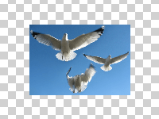

Changes the dimensions of an image, while attempting to preserve interesting content in the image.

   - `Width` — The width of the output image, in pixels.
   - `Height` — The height of the output image, in pixels.
   - `Rigidity` — How strongly to preserve vertical and horizontal lines all the way through the image.  At 0, this node may remove or insert craggy, winding paths through the image.  At 1, this node may only remove or insert vertical and horizontal lines.
   - `Preserve Mask`, `Discard Mask` — Optional images specifying which parts of the source image to try to preserve or discard.  For `Preserve Mask`, areas that are bright and opaque are preserved.  For `Discard Mask`, areas that are bright and opaque are discarded.  In both masks, areas that are dark or transparent are unaffected.  These masks should be the same size as the source image.

This is an expensive, CPU-based operation, so it will only work in realtime for small images (a few hundred pixels wide and high).  Once a given image has been processed, it can be efficiently resized, but changing the `Image`, `Rigidity`, or `Preserve` or `Discard Mask` requires re-processing the image, which will slow things down.  Higher `Rigidity` values are faster.

