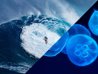

Combines two images, showing an image on each side of a line.

   - `Start Image` — The image to show when `Progress` is 0.
   - `End Image` — The image to show when `Progress` is 1.
   - `Progress` — A number from 0 to 1 for how far the transition has progressed.  Values ≤ 0 will show `Start Image`, and values ≥ 1 will show `End Image`.
   - `Angle` — The orientation, in degrees, of the line between the two images.
   - `Sharpness` — How sharp the line is. When 0, it's blurry; when 1, it's sharp.

The resulting image uses the dimensions of the start image (unless the start image is empty, in which case it uses the dimensions of the end image).

The end image is stretched to match the size of the start image.  If you want to combine images of different sizes without stretching them, use the [Resize Image](vuo-node://vuo.image.resize), [Crop Image](vuo-node://vuo.image.crop), or [Crop Image Pixels](vuo-node://vuo.image.crop.pixels) nodes.

