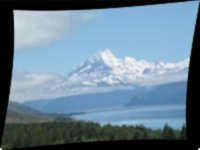

Distorts the image with a wave or ripple effect.

This node applies sinusoidal ripples to the image. The ripples can be animated to move across the image by sending gradually increasing values to the `Phase` port.

   - `Angle` — The angle or direction of the ripples, in degrees. At 0, the ripples move side to side as `Phase` increases. At 90, the ripples move up and down.
   - `Amplitude` — The amount that each ripple distorts the image. At 0, there is no distortion.
   - `Wavelength` — The size of each ripple, in Vuo Coordinates.
   - `Phase` — The current time in the wave cycle. At 1, the phase is back to the beginning of the cycle.

