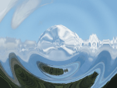

Distorts the image with a polar wave effect.

This node applies sinusoidal ripples to the image. The ripples can be animated to move through the image by sending gradually increasing values to the `Phase` port.

   - `Amplitude` — The amount that each ripple distorts the image. At 0, there is no distortion.
   - `Wavelength` — The size of each ripple, in Vuo Coordinates.
   - `Phase` — The current time in the wave cycle. At 1, the phase is back to the beginning of the cycle.
   - `Displacement` — The direction in which the wave displaces the image — transverse or longitudinal.

