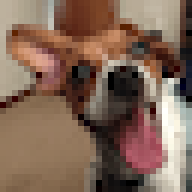

Changes the way that pixels are interpolated when using other nodes to resample an image.

By default, nodes that resize or warp an image (such as [Make Image Layer (Scaled)](vuo-node://vuo.layer.make.scaled) and [Ripple Image](vuo-node://vuo.image.ripple), respectively) will use smooth (bilinear) interpolation.  If instead the output image from this node is fed into those nodes, those nodes can pick the nearest pixel without any smoothing.

For example, if you start with this low-resolution image:  

By default, when Vuo enlarges the image, it will use bilinear interpolation:  

Using this node, you can tell it to pick the nearest pixel, without interpolation:  

Thanks to [Gisle Martens Meyer](https://uncannyplanet.com) for funding development of this node!
