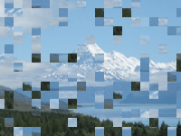

Distorts the image by splitting it into a grid of squares and rearranging the squares.

   - `Square Size` — The width and height of each square, in Vuo Coordinates. At 2, each square is as wide as the image.
   - `Center` — The position from which the squares appear to grow.  At (0,0), the squares appear to grow from the center; at (-1,0), the pixels appear to grow from the left edge.
   - `Chaos` — The fraction of squares to rearrange.  At 0, no squares are rearranged, and the image remains intact.  At 1, all squares are rearranged.
   - `Time` — Animates the positions of the squares cut from the image.

