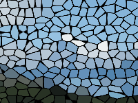

Distorts the image by making it look like it was created out of stained glass.

   - `Tile Size` — The average width and height of each tile, in Vuo Coordinates. At 0, the image is unchanged. At 0.2, each tile is one tenth of the image width.
   - `Center` — The position from which the tiles appear to grow.  At (0,0), the tiles appear to grow from the center; at (-1,0), the tiles appear to grow from the left edge.
   - `Chaos` — How much each tile deviates from a grid.  At 0, each tile is square.  At 1, each tile has a different shape.
   - `Border Color` — The color of the gap between each tile.
   - `Border Width` — The percent of each tile occupied by the border.  At 0, there are no borders.  At 0.5, each border is half the size of its tile.

