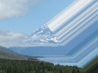

Adds a border to an image, where the border is filled with the outermost pixel of the image.

   - `Left`/`Right`/`Top`/`Bottom` — The positions of the edges of the rectangular area, ranging from 0 (left or bottom) to 1 (right or top).
   - `Sharpness` — How immediately to start stretching — at 1, the transition between the preserved area and the stretched pixels is immediate; at 0, the transition is gradual.
   - `Angle` — The rotation, in degrees, of the rectangular area.
   - `Fade` — The amount to fade out the stretched pixels — at 1, the stretched pixels are fully transparent.
   - `Fade Sharpness` — How sharp the transition into the fade is.  A value of 0 means the transition is very gradual; a value of 1 means the transition is immediate.

