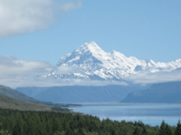
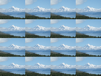

Repeats an image by tiling it in a grid.

This node can be used to:

   - Display multiple smaller copies of an image (if `Width` is less than 2).
   - Display a magnified portion of an image (if `Width` is greater than 2).
   - Animate an image so that it wraps around as it moves horizontally or vertically (if `Width` is equal to 2).

The output image has the same width and height in pixels as the input image. Each tile has the same aspect ratio as the input image.

The number of rows and columns of tiles in the output image is 2 divided by `Width` (in other words, the image width divided by the tile width in Vuo Coordinates). If the number of rows and columns is not an integer, then some tiles along the edges are only partially displayed.

   - `Center` — The position in the output image at which the center 4 images' corners touch, in Vuo Coordinates.
   - `Width` — The size of each tiled image, in Vuo Coordinates.
   - `Reflect Odd Rows` — When true, odd-numbered rows (counting up from the center) are flipped, to produce a continuous image.  When false, each copy of the image is translated but not reflected.
   - `Reflect Odd Columns` — When true, odd-numbered columns (counting right from the center) are flipped, to produce a continuous image.  When false, each copy of the image is translated but not reflected.

