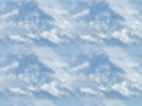

Wraps and blends an image so it's seamlessly tileable.

This node crops the edges off the image, then blends each edge into the opposite side of the image.  `Blend Width` controls the total amount, in Vuo Coordinates, to crop from each pair of edges.  At 0, the input image is unchanged.  At 1, a quarter of the image is cropped off left, right, top, and bottom.

You can then connect the output of this node to [Tile Image](vuo-node://vuo.image.tile):

