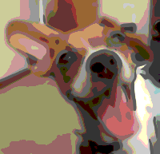
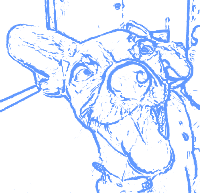

Traces an image's edges and reduces its colors, to make it look like a comic illustration.

   - `Blur Radius` — The maximum radius, in points, to affect when applying blur before tracing.  Useful for reducing noise and giving the image an airbrushed look.
   - `Edge Color` — The color to draw the image's edges.
   - `Edge Width` — The size, in points, of the image's edges.
   - `Edge Threshold` — How picky to be about what constitutes an edge.  Lower values result in more edges; higher values result in fewer edges.
   - `Image Colors` — How many variations of each color channel to use when filtering a pixel.  For example, a value of 6 means that the Red, Blue, and Green channels that make up a color will each have 6 shades, making 216 total color possibilities (6 * 6 * 6).
   - `Show Image` — Whether to show the (blurred) original image behind the traced lines.  If false, the edges will be drawn and the rest of the image will be transparent.

Thanks to [Brad Larson](https://github.com/BradLarson/GPUImage) and [Martinus Magneson](https://community.vuo.org/u/MartinusMagneson) for the GLSL implementation this node is based on.
