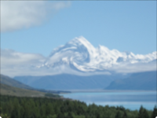

Distorts the image by twirling it around a point.

   - `Center` — The central point of the twirl, in Vuo Coordinates.
   - `Angle` — The amount of rotation in the twirl, in degrees. At 0, there is no twirl.
   - `Radius` — The radius or size of the twirl, in Vuo Coordinates. At 0, there is no twirl.
   

 
