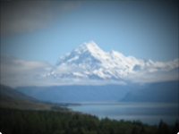

Tints the image around the edges. 

The tinted area forms an oval frame around the image, fading from the original image to the given color. 

   - `Color` - The color of the oval.
   - `Width` — The width of the oval, in Vuo Coordinates. (The height is calculated from the image's aspect ratio.) 
   - `Sharpness` — How sharp the edge of the oval is. A value of 0 means the transition to `Color` is very gradual; a value of 1 means the transition is immediate.
   - `Replace Opacity` — Determines how the vignette's color is combined with the image.  If true, the vignetted areas of the image are replaced by the `Color` port's value — so if the color is transparent, the output image's edges will be transparent.  If false, the vignette color is overlaid on the image — so if the color is transparent, the output image's edges will show the original image.

