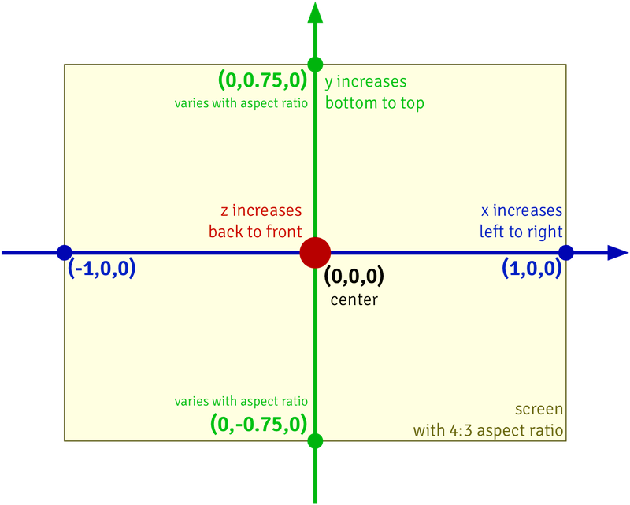

These nodes are for working with layers to create composite images. 

Layers are a unique data type that are similar to images, but can be combined together as if they were stacked on top of one another. To create a layer, you can use one of the `Make Layer` nodes. To combine layers into a composite image, you can use one of the `Render Layers` nodes. 

When creating a layer from an image, you can choose whether the node should be rendered at **Real Size** — with each pixel in the original image drawn as a single pixel in the composite image. A Real-Size layer can be translated but can't be rotated or scaled. The `Make Layer` and `Make Layer with Shadow` nodes create a Real-Size layer, while the `Make Scaled Layer` and `Make Scaled Layer with Shadow` nodes do not.  

In **Vuo coordinates**, (0,0) is the center of the composite image. The composite image has a width of 2, with x-coordinate -1 on the left edge and 1 on the right edge. The composite image's height is determined by its aspect ratio, with the y-coordinate increasing from bottom to top. 

