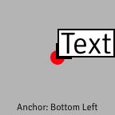

These nodes are for working with 2D objects called layers that can be combined to create composite 2D images.

A **layer** is a rectangle that contains one or more images, texts, or shapes. For example, each of the `Make Image Layer` nodes inputs an image and outputs a layer whose rectangle is filled with that image. The `Make Oval Layer` node outputs a layer whose rectangle has a transparent background and contains an oval that extends to the edges of the rectangle.

Layers can be combined together as if they were stacked on top of one another to create a composite image. For example, the `Render Layers to Window` node inputs a list of layers, ordered from background to foreground, and composites them to create the single image displayed in the window.

Nodes that create layers input a position, which determines where the layer is placed in the composite image.

Most of the nodes that create layers input a size, which determines how big the layer is relative to the composite image. For example, the `Make Color Layer` node has input ports Width and Height. The `Make Image Layer (Scaled)` node has input port Width, and the layer's height is determined by the aspect ratio of the input image. The layers outputted by these nodes are called **scaled layers** because their size scales with the size of the composite image.

A few nodes create a different kind of layer. **Real Size layers** are always rendered at the same size no matter how large or small the composite image. The `Make Image Layer (Real Size)` and `Make Text Layer` nodes both output Real Size layers. The purpose is to keep the image or text sharp, rather than allowing it to become blurred by resizing. A Real Size layer can be translated but can't be rotated or scaled.

If you want several layers to move together, you can **group** them with the `Combine Layers` nodes. Each of these nodes inputs a list of layers and outputs a "parent" layer that contains all of the input "child" layers. Instead of moving the child layers individually, you can move the parent layer, and all of the child layers move with it.

### Anchors and positions

Most nodes that create a layer determine the layer's placement with an **anchor** and a **position**. The position is a point in the composite image. The anchor is the part of the layer that should be located at that point. For example, if the anchor is the bottom left corner of the layer, the layer will be placed so that its bottom left corner is at the given position. If the anchor is the center of the layer, the layer will be centered at the given position.

The diagram below shows the placement of a layer created by `Make Text Layer`, with a red dot showing the position.

### Real Size layers and Retina screens

Each image has a **Scale Factor**.  If the image's filename has a scale suffix (such as the `@2x` in `image@2x.png`), it is used as the image's Scale Factor.  Otherwise the Scale Factor is 1x.  The Scale Factor is used when rendering a Real Size layer with the `Preserve Physical Size` port set to true.

For example, when `Preserve Physical Size` is false:

&nbsp;                         | Non-Retina (1x) screen                         | Retina (2x) screen
------------------------------ | ---------------------------------------------- | ----------------------------------------------
**Image with Scale Factor 1x** | Each image pixel is rendered as 1 screen pixel | Each image pixel is rendered as 1 screen pixel
**Image with Scale Factor 2x** | Each image pixel is rendered as 1 screen pixel | Each image pixel is rendered as 1 screen pixel

And when `Preserve Physical Size` is true:

&nbsp;                         | Non-Retina (1x) screen                                           | Retina (2x) screen
------------------------------ | ---------------------------------------------------------------- | -----------------------------------------------------
**Image with Scale Factor 1x** | Each image pixel is rendered as 1 screen pixel                   | Each image pixel is rendered as 4 screen pixels (2x2)
**Image with Scale Factor 2x** | Each group of 4 image pixels (2x2) is rendered as 1 screen pixel | Each image pixel is rendered as 1 screen pixel

### Names

Several layer nodes, such as the `Is Point within Layer` node and the `Receive Mouse Drags on Layer` node use a layer's name to detect what layer to act on. The `Layer Name` entered must exactly match the name in the original layer's `Layer Name` port. A name with a trailing space, for example, will not match a name without a trailing space.

### Coordinates

In **Vuo Coordinates**, (0,0) is the center of the composite image. The composite image has a width of 2, with X-coordinate -1 on the left edge and 1 on the right edge. The composite image's height is determined by its aspect ratio, with the Y-coordinate increasing from bottom to top. 

