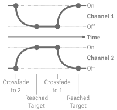

Smoothly changes between 2 values.

This node starts out with output `Channel 1 Value` set to `On Value`, and output `Channel 2 Value` set to `Off Value`.  When an event hits `Toggle` or `Crossfade to 2`, the node begins allowing `Time` events to pass, gradually changing `Channel 1 Value` to `Off Value`, and `Channel 2 Value` to `On Value`.  Then, when the next event hits `Toggle` again, or hits `Crossfade to 1`, the node begins transitioning back to its original state.

   - `Time` — The time at which to calculate the transition progress.
   - `Crossfade to 1` — Start transitioning channel 1 to On, and channel 2 to Off.
   - `Crossfade to 2` — Start transitioning channel 1 to Off, and channel 2 to On.
   - `Toggle` — Start transitioning to the channel that isn't currently selected.
   - `Off Value` — The value to output when faded out completely.
   - `On Value` — The value to output when faded in completely.
   - `Duration` — The length, in seconds, of the transition.
   - `Curve` — The shape of the transition curve from off to on, and from on to off.
   - `Easing` — Which part of the transition curve is shallow.

If `Off Value` and `On Value` are 2D or 3D points (as opposed to real numbers), then each coordinate of `Channel 1 Value` and `Channel 2 Value` is calculated separately.  For example, the X-coordinate of `Channel 1 Value` will fall along a curve based on the X-coordinates of `Off Value` and `On Value`, and the Y-coordinate of `Channel 1 Value` will fall along a curve based on the Y-coordinates of `Off Value` and `On Value`.

