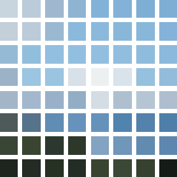
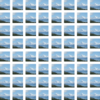

Removes the texture coordinates from a 3D object.

This node is primarily useful when working with point or line meshes.  Some point or line meshes (such as those created by [Make Grid Points Object](vuo-node://vuo.scene.make.grid.points), [Make Grid Lines Object](vuo-node://vuo.scene.make.grid.lines), and [Make Random Points Object](vuo-node://vuo.scene.make.random.points)) have texture coordinates that cause the shader to map images across the entire composite object.  By removing the texture coordinates, the shader will apply the image individually to each point or line.

For example, here's an image of an 8x8 grid of points (from [Make Grid Points Object](vuo-node://vuo.scene.make.grid.points)) shaded with an image of mountains:

Removing the texture coordinates causes the image to be mapped individually per point:

