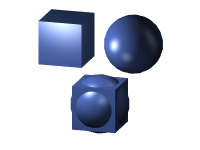

Creates an object representing the union of all the input objects (the objects' combined volume), and assigns a new material to that object.

`Quality` specifies the tradeoff between performance and accuracy.  At 0, the calculations are fast but highly inaccurate.  At 1, the calculations are more accurate but slower.  This is a fairly expensive CPU-based process, so only meshes with a fairly low number of elements (a few thousand) can work in realtime.

This node only works with triangle meshes; point and line meshes are ignored.
