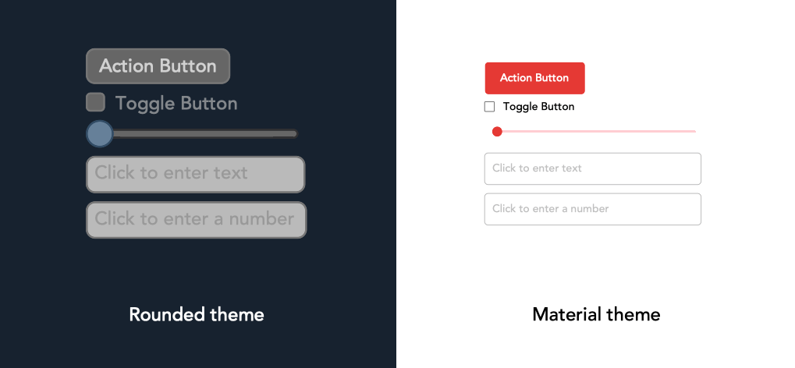

Nodes for creating and styling a user interface (UI).

## Widgets
Using these nodes, you can create on-screen controls that allow end-users to trigger actions or change values in a composition:

   - [Make Action Button](vuo-node://vuo.ui.make.button)
   - [Make Toggle Button](vuo-node://vuo.ui.make.toggle)
   - [Make Slider](vuo-node://vuo.ui.make.slider)
   - [Make Text Field](vuo-node://vuo.ui.make.text)
   - [Make Number Field](vuo-node://vuo.ui.make.number)

By default, these widgets use a gray and blue color scheme with rounded corners.  You can customize their appearance using the [Make Material Theme](vuo-node://vuo.ui.make.theme.material) node (based on the [Material Design System](https://material.io/design/)), or set individual fonts, colors, and attributes using these nodes:

   - [Make Action Button Theme (Rounded)](vuo-node://vuo.ui.make.theme.button.rounded2)
   - [Make Toggle Button Theme (Rounded)](vuo-node://vuo.ui.make.theme.toggle.rounded)
   - [Make Slider Theme (Rounded)](vuo-node://vuo.ui.make.theme.slider.rounded)
   - [Make Text Field Theme (Rounded)](vuo-node://vuo.ui.make.theme.text.rounded)

Using the [Combine Widget Themes](vuo-node://vuo.ui.theme.combine) node, you can create reusable, cohesive themes — collect multiple widget themes together into a single item, and connect that theme to any widget.
